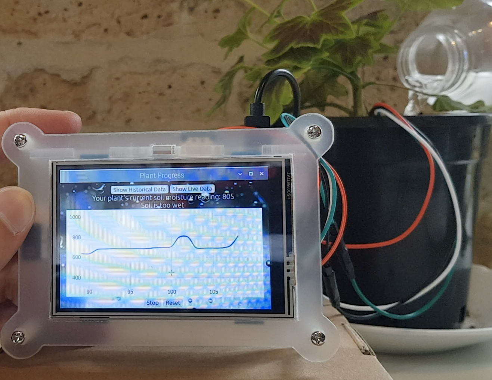

# F R A N C E S C A &nbsp; C H A T E R 

I am a Junior Developer looking for my first job to learn all sorts of exciting new things. One of the best things I have taken from Maker's Academy is if I can learn one thing, I can learn another.

# S K I L L S

L O V E &nbsp; O F &nbsp; T E C H 

The most amazing and surprising discovery I have experienced through tech is reconnecting to all my old loves. When I told my mum I wanted to learn how to programme, she replied, "Well that makes complete sense considering how much you loved computer games."

I forgot how much I loved computer games - it was deeply satifying to build something up methodically (an empire, a city, a themepark) and see that creation in action.

I have always loved cartoons and animations and I can't wait to build my first AR app as a fun side project. 
 

Below are my favourite projects from my time at Makers.

P R O J E C T 🌵 D E E P R O O T
 
_[Project Github](https://github.com/breycarr/deep_root)_

For the final project, our team built a plant health monitoring system. We used all new software and we had never used any of the hardware before. 
Building something with code that took live readings from a real, living thing was such an incredible feeling. I loved combining code with something that is quintessentially the complete opposite of technology.

We want lights!

 

No wait, we want a touchscreen!

 

[Video Presentation](https://en-gb.facebook.com/MakersAcademy/videos/1335893893240030) 
  17:17 Project Deeproot

We documented any particularly exciting moments in our shared team [blog](https://medium.com/@makers_c_a_c_t_u_s). For example, we had never tested hardware before. If something doesn't work how you thought it would - a light doesn't turn on or the touch screen stops working after you merge everything - how do you fix that? After quickly suppressing mild panic, we were able to fix these issues in the same way we would fix bugs in our code. We eradicated possibilities by confirming parts we knew were working and got visibility in our code to ensure all our code was being reached. For more details, [here](https://medium.com/@makers_c_a_c_t_u_s/how-do-you-tdd-hardware-25f62da9aa) is how we discovered why our light wasn't turning on. As our first hardware bug, it was very exciting when we located the problem.

-----
S P A C E B O O K
 
_[Project Github](https://github.com/fetc90/acebook-spacebook)_
 
_[Live App](https://acebook-spacebook.herokuapp.com/)_

Finally, an app for aliens to communicate with their friends.*

 <!-- DROP DOWN SECTION ------- -->

 Aliens can sign up and login. 

 

 

 They can write messages and edit them within 10 minutes of posting. 

 

  

Search for an alien who hasn't registered for Spacebook yet.

 

 <!-- DROP DOWN SECTION ENDS------- -->

We deployed Spacebook automatically to Heroku with Travis CI. Setting it up was one of the most challenging parts of the project; all our tests were passing on Travis but the build wasn't deploying. As we were so new to both systems we weren't sure why the connection broke down. But you'll be relieved to know we fixed it. It was such a relief I felt compelled to [write about it](https://medium.com/@spacebook3000/fixing-heroku-by-francesca-b1d2e5a9e1ec).  

*_NASA verfied._

# E D U C A T I O N

**Makers Academy (April '19 to July '19)**  
[Blog of Select Maker's Moments](https://medium.com/@fetc)

T E S T I N G

- Test Driven Development (TDD) in RSpec, Jasmin and Cabybara. 
- High test code coverage ( > 95%) and code maintainability.
- Continuous Integration: Travis CI to Heroku.

P R O C E S S

- Object Orientated Programming (OOP). 
- Clean code (DRY) with Single Responsibility Programming (SRP). Use of linters. 
- Learning a new language / programme fast: Ruby, Ruby on Rails and Javascript. Front-end styling with CSS and HTML5.
- Databases: PostgreSQL, Datamapper, ActiveRecord.

T E A M W O R K

Working as a team using agile practises:
 - Pair programming and mobbing.
 - Regular stand-ups and retros for group projects. 
 - Documenting team process.
 - Project collaboration on Github. 

 ---

<!-- If I want to do drop downs --------------- -->

<!-- 

Test Driven Development (TDD).

 

Agile methodologies.

 

Language agnostic.

 

 -->

<!-- If I want to do drop downs --------------- -->

#### University of Sussex (Sep '10 to May '14)

H U M A N &nbsp; R I G H T S &nbsp;*Master's Degree (Merit)*

I based my dissertation on women in prisons in the UK. I interviewed prison staff across the board, including male and female officers, a counsellor from the sexual offenders ward, a nurse and the prison warden. The research was engrossing and the experience was the most rewarding I had at university. Because of this, one day I would like to volunteer as a teacher in prisons, teaching either creative writing or computer programming. 
 
E N G L I S H &nbsp; L I T E R A T U R E &nbsp; & &nbsp; A R T &nbsp; H I S T O R Y &nbsp;*Bachelor of Arts (2:1)*

During my BA, I learnt the invaluable lesson of how not to write. I loved reading novels and studying emotive (and some not so emotive) pieces of art, at the same time I was reading a lot of critical essays on literature and art – and unfortunately I started imitating those essays in my own writing. It was not effective. What point was I trying to make? Who knows, you've fallen down my Alice-in-Wonderland-tunnel of a sentence. You want the readers on your side. You also want to know exactly what you're talking about. Sure, obvious now, but it takes a couple of years of waffle to fully comprehend how little sense you’re making. 

# E X P E R I E N C E

Previous work experience in managing brand communication campaigns and publicity campaigns. Skills in pitching to press, copywriting, photo editing, CRM databases,Facebook acquisition and Google Analytics.

**Sport Heroes Group** (May '17 to December '18)    
*UK Content and Community Lead*

- Building brand communication campaigns with a reach of over 1.6 million for major sports brands including Nike, adidas, Polar, Salomon and leading lifestyle brands including Bose and Ted Baker; charities include UNICEF.
- Writing campaign reports outlining the communication strategy, metrics and evaluation. Data gathered from Google Analytics, social media analytics, Intercom and Mailjet.
- Working with the business development team to build new and maintain current relationships with clients, to then go on to lead their communication campaigns.
- Coordinating content production; outsourcing and managing a team of five content writers and deciding on topics of discussion. Reader engagement tripled from February to June 2018 and has remained consistent at 3,000 readers.
- Researching topics of that week to create the weekly newsletters, ranging from news in the running world, science, lifestyle or nutrition, reaching an audience of 70,000 with a 20% open rate.  
- Managing the social media accounts for Running Heroes and Cycling Heroes, across Facebook (26,000+ followers), Twitter (3500+ followers) and Instagram (1300+ followers).
- Hosting monthly social community runs of 50 people. The UK team had a record turn-out compared to French and Australian Sport Heroes teams, who both had a turn-out of 20.

**tpr Media Consultants** (August '15 to April '17)   
*Account Manager*  

tpr is a PR company focusing on film and televison releases. Though I started more on the content side of things (gathering press materials and writing releases), I found to my great surprise that I gravitated towards the accounts. I also quickly became the token 'IT guy' of the office. 

**YPlan** (October '14 to June '15)   
*Content Producer*

This was my first expereince working with software developers. My role was to write content and edit images that would engage the users. Every week, there was a meeting with all the staff members about what could be done to improve the app and I could listen to the developers talk about what they had acheived.

# H O B B I E S

I love going to art exhibitions, one of the most amazing exhibitions I went to was Marshmellow Laser Feast, _We Live in an Ocean of Air_. I had never seen art and technology combined like that and seeing that sparked a huge interest in VR and AR I'd never had before. I'm a member of the Tate Modern and the two recent exhibitions - Takis and Olafur Eliasson - have been my favourite ones I've seen there in a long time.

I like taking photos but I forgot how much I loved painting - wanting to have a break from coding meant that I bought a sketch pad and paints again.

I got very into cycling; I cycled from Milan to Barcelona in two weeks, staying in eco-villages and camping.

I work a shift at The Green Note in Camden once a week. This hodge-podge-living-room of a music venue is one of Time Out's favourites, and some really whacky, wonderful bands play there.
